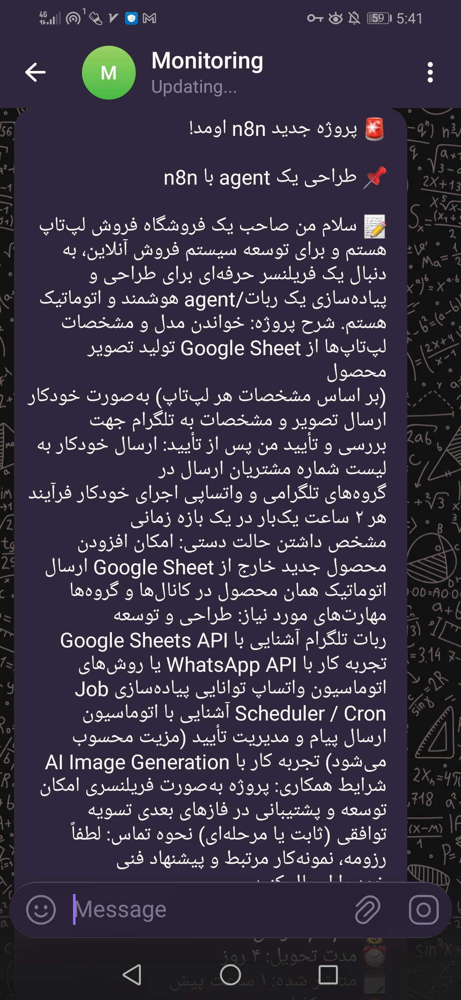
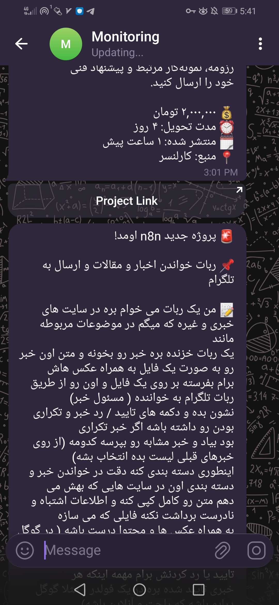

# 🚀 Monitoring Iranian Freelancing Projects on Any Niche

## معرفی پروژه
این یک **سیستم اتوماسیون Low-Code** است که برای **مانیتورینگ لحظه‌ای** پروژه‌های جدید فریلنسری در **هر حوزه تخصصی (Niche)** دلخواه شما طراحی شده است. این سیستم به صورت ۲۴/۷ پلتفرم‌های **پونیشا** و **کارلنسر** را اسکرپ کرده و پروژه‌های جدید را بلافاصله از طریق تلگرام برای شما ارسال می‌کند.

## ✨ مهم‌ترین ویژگی‌ها
* **قابلیت مقیاس‌پذیری و انعطاف‌پذیری (Niche Agnostic):** با تغییر تنها یک عبارت در نودهای تنظیمات (Set)، می‌توانید حوزه جستجو را به هر تخصصی (مانند Python، UI/UX، SEO و...) تغییر دهید.
* **اطلاع‌رسانی بلادرنگ:** تضمین می‌کند که شما فقط پروژه‌های منتشر شده در **۱ ساعت اخیر** را دریافت کنید.
* **حل چالش فنی:** فیلترینگ پیشرفته‌ای برای حل مشکل فیلتر کردن تاریخ‌های فارسی (مثل "لحظاتی پیش" و "ساعاتی قبل") برای کارلنسر دارد.

## ⚙️ نحوه راه‌اندازی (آماده برای هر فریلنسر)

1.  **Import:** فایل JSON WorkFlow را در ابزار اتوماسیون خود Import کنید.
2.  **Define Your Niche:**
    * نودهای با عنوان **`Niche (Ponisha)`** و **`Niche (Karlancer)`** را پیدا کنید.
    * مقدار **`Niche`** را به حوزه تخصصی خود تغییر دهید (مثلاً `Data Science`, `Mobile App` و...).
3.  **Telegram Setup:**
    * Credential و Chat ID ربات تلگرام خود را تنظیم کنید.
4.  **Activate:** سیستم مانیتورینگ را فعال کنید.

## نمونه خروجی Workflow

| | |
|---|---|
|  |  |

---
**Creator:** Saeed Khorsandi
